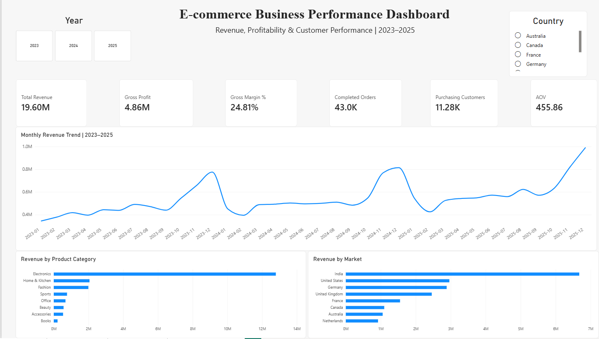
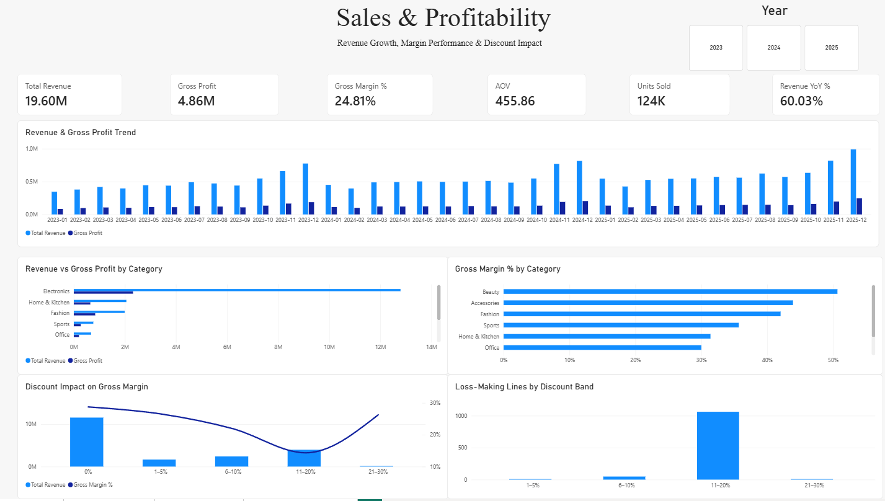
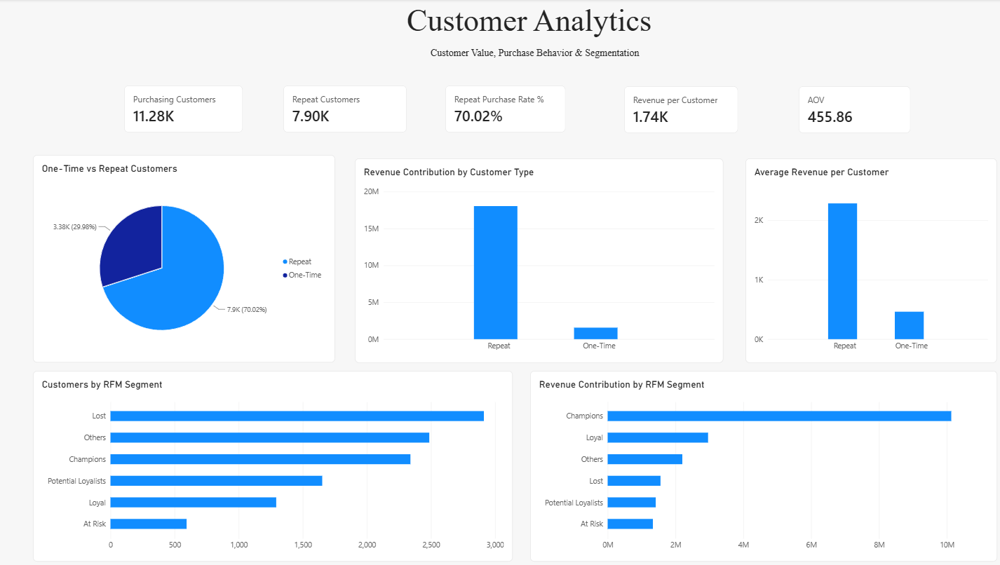
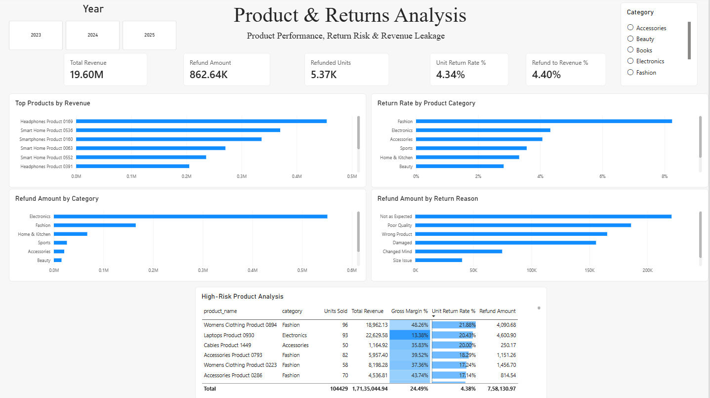

# E-commerce Revenue, Customer & Product Analytics

### End-to-End Business Analytics Case Study | PostgreSQL • Python • Pandas • Power BI

An end-to-end analytics project analyzing **200K+ e-commerce records** across customers, orders, products, payments, and returns to understand:

- Revenue growth and seasonality
- Profitability and discount impact
- Customer value and retention
- RFM customer segmentation
- Product performance
- Return risk and revenue leakage

The project follows a complete analytics workflow:

**Raw Data → Data Validation → PostgreSQL → Python/Pandas → Power BI → Business Insights**

---

## 📊 Dashboard Preview

### Executive Overview



### Sales & Profitability



### Customer Analytics



### Product & Returns Analysis



---

## 🎯 Business Problem

The business is growing, but revenue growth alone does not answer the questions management needs to make better decisions.

This project investigates:

- Is revenue growth translating into profitable growth?
- What is actually driving revenue growth?
- Which categories and products generate the most value?
- How are discounts associated with profitability?
- How important are repeat customers?
- Which customer segments contribute the most revenue?
- Which customers may represent retention opportunities?
- Which products and categories create the highest return risk?
- How much revenue is being lost through refunds?

---

## 🛠️ Tech Stack

| Technology | Application |
|---|---|
| **PostgreSQL** | Data validation, transformation and business analysis |
| **SQL** | Joins, CTEs, aggregations, window functions and segmentation |
| **Python** | Exploratory and analytical analysis |
| **Pandas** | Data manipulation and feature engineering |
| **Power BI** | Data modeling, DAX and interactive dashboards |
| **GitHub** | Documentation and project presentation |

---

## 📁 Dataset

The project uses a **synthetic international e-commerce dataset** covering transactions from **January 2023 to December 2025**.

| Dataset | Rows |
|---|---:|
| Customers | 15,000 |
| Products | 1,500 |
| Orders | 45,000 |
| Order Items | 92,002 |
| Payments | 45,000 |
| Returns | 5,416 |

The dataset includes customers across markets such as India, Germany, the United States, United Kingdom, France, Netherlands, Australia, and Canada.

> **Note:** All customers, products, transactions, brands and suppliers in this project are synthetic. No real customer or company information is used.

Detailed dataset documentation is available in [`data/README.md`](data/README.md).

---

## 🔍 Data Quality & Validation

Before analysis, the dataset was checked for:

- Duplicate records
- Missing values
- Referential integrity
- Invalid quantities and prices
- Negative revenue
- Transaction consistency
- Order/payment reconciliation
- Customer/order date consistency

One synthetic-data issue was identified:

**19,678 orders originally had an order date earlier than the corresponding customer's signup date.**

For analytical consistency, affected signup dates were aligned with each customer's earliest recorded order date.

In a production environment, this type of issue would first be investigated with the source system or data engineering team before records were modified.

Full validation logic:

[`sql/01_data_quality.sql`](sql/01_data_quality.sql)

---

## 📈 Executive KPIs

| KPI | Result |
|---|---:|
| **Total Revenue** | **19.60M** |
| **Gross Profit** | **4.86M** |
| **Gross Margin** | **24.81%** |
| **Completed Orders** | **43,001** |
| **Purchasing Customers** | **11,279** |
| **Average Order Value** | **455.86** |
| **Units Sold** | **123,654** |
| **Refund Amount** | **862.64K** |
| **Unit Return Rate** | **4.34%** |
| **Refund-to-Revenue** | **4.40%** |

---

# 💡 Key Business Insights

## 1. Revenue Growth Was Primarily Volume Driven

Revenue increased from:

- **5.80M in 2023**
- **6.45M in 2024**
- **7.35M in 2025**

Revenue grew approximately **11.16% in 2024** and **14.03% in 2025**.

However, Average Order Value remained almost unchanged:

| Year | AOV |
|---|---:|
| 2023 | 455.14 |
| 2024 | 455.01 |
| 2025 | 457.19 |

This indicates that revenue growth was driven primarily by **increasing transaction volume rather than larger baskets**.

---

## 2. Electronics Drives Revenue but Has Margin Pressure

Electronics generated approximately:

**12.79M Revenue | 2.32M Gross Profit | 18.12% Gross Margin**

It contributed roughly **65% of total company revenue**, making it the dominant category.

However, its margin was substantially below several other categories.

For comparison, **Beauty achieved approximately 50.66% gross margin**.

**Business implication:** Revenue alone is not enough to evaluate product performance. Electronics should be monitored closely for pricing, cost, discount and return performance.

---

## 3. Discounts Are Associated With Margin Compression

Gross margin generally declined as discounts increased through the 0–20% range.

| Discount Band | Gross Margin |
|---|---:|
| 0% | 28.75% |
| 1–5% | 26.55% |
| 6–10% | 21.88% |
| 11–20% | 14.32% |

The analysis identified **1,113 loss-making completed order lines**.

Average discount:

- Loss-making lines → **18.31%**
- Profitable lines → **5.86%**

This shows an association between discounting and profitability in the dataset, but does **not establish discounting as the sole cause** of losses. Product mix and cost structure also matter.

---

## 4. Repeat Customers Are Significantly More Valuable

Of **11,279 purchasing customers**:

- **7,897** were repeat customers
- **3,382** were one-time customers
- Repeat Purchase Rate = **70.02%**

Average customer revenue:

| Customer Type | Average Revenue |
|---|---:|
| Repeat | ~2,284 |
| One-Time | ~462 |

Repeat customers generated approximately **5x the average revenue** of one-time customers.

Customer value was also concentrated:

- Top 10% of customers → ~39% of revenue
- Top 20% → ~58%
- Top 30% → ~71%

---

## 5. RFM Segmentation Revealed High-Value Customer Groups

Customers were segmented using **Recency, Frequency and Monetary Value**.

| Segment | Customers | Revenue |
|---|---:|---:|
| **Champions** | 2,340 | 10.13M |
| **Loyal** | 1,293 | 2.96M |
| **Others** | 2,487 | 2.20M |
| **Lost** | 2,913 | 1.56M |
| **Potential Loyalists** | 1,652 | 1.42M |
| **At Risk** | 594 | 1.33M |

Champions generated approximately **half of total customer revenue**.

Meanwhile, only **594 At Risk customers** had historically generated approximately **1.33M**, making this segment relevant for targeted reactivation analysis.

The final RFM segmentation was generated in Python with explicit tie handling before being imported into Power BI.

---

## 6. Returns Created 862K+ in Revenue Leakage

Finalized refunds totaled approximately:

**862.64K**

This represents approximately **4.40% of total revenue**.

Key return KPIs:

- Refunded Units → **5,366**
- Unit Return Rate → **4.34%**
- Orders With Refunds → **4,264**
- Order Return Rate → **9.92%**

Net revenue after finalized refunds was approximately:

**18.74M**

---

## 7. Fashion Has the Highest Return Rate, but Electronics Has the Largest Financial Impact

Fashion recorded the highest relative unit return rate:

**8.24%**

Electronics had a lower return rate of approximately **4.32%**, but generated approximately:

**550.85K in refunds**

This highlights an important analytical distinction:

> **Return Rate = Relative Risk**  
> **Refund Amount = Financial Impact**

Both should be considered when prioritizing corrective action.

---

## 8. Return Reasons Point to Different Operational Problems

The largest refund reasons were:

| Return Reason | Refund Amount |
|---|---:|
| Not as Expected | 220.79K |
| Poor Quality | 185.89K |
| Wrong Product | 165.33K |
| Damaged | 155.72K |

**Not as Expected + Poor Quality represented approximately 47% of total refund value.**

Patterns differed by category:

- **Electronics:** expectation, quality, damage and fulfillment accuracy
- **Fashion:** size, fit and preference-related returns
- **Home & Kitchen:** comparatively stronger late-delivery impact

This suggests that return-reduction strategies should be **category-specific rather than one-size-fits-all**.

---

# 🎯 Business Recommendations

Based on the analysis:

1. **Protect high-value customers**  
   Prioritize Champions and Loyal customers through retention and personalized engagement.

2. **Reactivate At Risk customers**  
   Target historically valuable customers whose purchasing activity has declined.

3. **Review discount strategy**  
   Evaluate promotions using margin and incremental profitability rather than revenue alone.

4. **Protect Electronics profitability**  
   Review high-revenue, low-margin products for pricing, supplier cost and discount pressure.

5. **Reduce Fashion returns**  
   Improve sizing information, fit guidance, product descriptions and expectation-setting.

6. **Reduce Electronics refund leakage**  
   Investigate product quality, specifications, fulfillment accuracy, packaging and supplier performance.

7. **Monitor high-risk SKUs**  
   Evaluate products using **Revenue + Margin + Return Rate + Sales Volume + Refund Value**.

8. **Plan around seasonality**  
   Use stronger November–December demand patterns for inventory, marketing and fulfillment planning.

For the complete business analysis:

### ➡️ [`Business Insights & Recommendations`](docs/business_insights.md)

---

# 📊 Power BI Dashboard

The final Power BI solution contains **four analytical pages**.

### 1. Executive Overview

Management-level view of revenue, profit, margin, customers, orders, AOV, market performance and category performance.

### 2. Sales & Profitability

Analysis of revenue growth, gross profit, category margins, discount impact and loss-making transactions.

### 3. Customer Analytics

Analysis of repeat customers, customer value, revenue contribution and RFM segmentation.

### 4. Product & Returns Analysis

Analysis of product performance, category return rates, refund leakage, return reasons and high-risk products.

---

# 🧮 SQL Analysis

SQL analysis is organized into six business-focused modules:

```text
sql/
├── 01_data_quality.sql
├── 02_kpi_sales_analysis.sql
├── 03_profitability_analysis.sql
├── 04_customer_analysis.sql
├── 05_rfm_analysis.sql
└── 06_returns_analysis.sql
```

The SQL work demonstrates:

- Multi-table joins
- CTEs
- Aggregations
- Conditional aggregation
- Window functions
- `LAG()`
- `NTILE()`
- Customer-level analysis
- Revenue concentration
- Profitability analysis
- Return and refund analysis

---

# 🐍 Python Analysis

Python and Pandas were used to extend and validate the SQL analysis.

The notebook covers:

- Data inspection
- Data quality validation
- Feature engineering
- Revenue and profitability analysis
- Customer behavior analysis
- Discount analysis
- Product risk analysis
- Return analysis
- RFM segmentation

### ➡️ [`View Python Analysis`](python/ecommerce_analysis.ipynb)

---

# 📂 Repository Structure

```text
ecommerce-business-analytics/
│
├── README.md
│
├── data/
│   ├── README.md
│   └── customer_rfm.csv
│
├── sql/
│   ├── 01_data_quality.sql
│   ├── 02_kpi_sales_analysis.sql
│   ├── 03_profitability_analysis.sql
│   ├── 04_customer_analysis.sql
│   ├── 05_rfm_analysis.sql
│   └── 06_returns_analysis.sql
│
├── python/
│   └── ecommerce_analysis.ipynb
│
├── powerbi/
│   └── Ecommerce_Business_Analytics_Dashboard.pbix
│
├── screenshots/
│   ├── 01_executive_overview.png
│   ├── 02_sales_profitability.png
│   ├── 03_customer_analytics.png
│   └── 04_product_returns.png
│
└── docs/
    └── business_insights.md
```

---

# 🔄 Project Workflow

```text
Synthetic E-commerce Data
          ↓
Data Quality Validation
          ↓
PostgreSQL / SQL Analysis
          ↓
Python / Pandas Analysis
          ↓
RFM Customer Segmentation
          ↓
Power BI Data Modeling & DAX
          ↓
Interactive Dashboard
          ↓
Business Insights & Recommendations
```

---

# ⭐ Project Highlights

- Analyzed **200K+ records** across six relational datasets
- Built and validated business KPIs using PostgreSQL
- Analyzed three years of revenue and profitability trends
- Investigated discount and margin relationships
- Analyzed repeat purchasing and customer value concentration
- Built RFM customer segmentation
- Identified product and category-level return risks
- Quantified **862K+ in finalized refund leakage**
- Built a **four-page Power BI dashboard**
- Translated technical analysis into business recommendations

---

# 👤 Author

## Rahul Saxena

**Data Analytics | SQL | Python | Pandas | Power BI | Excel**

This project was developed as an end-to-end analytics case study focused on translating transactional data into **business insights and decision-support recommendations**.
